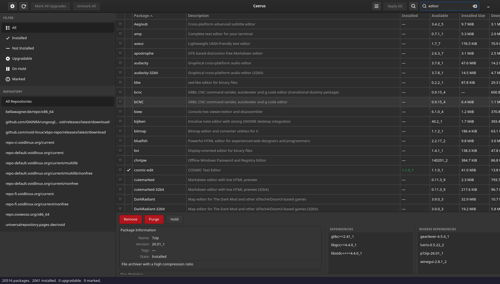

# Caerus

A package manager for [Void Linux](https://voidlinux.org/) inspired by [Synaptic](https://en.wikipedia.org/wiki/Synaptic_(software)) built
directly on `libxbps`. GTK4, no root required to run — only the small
privileged helper that actually installs/removes packages is ever elevated,
via `pkexec`.

> **Disclaimer:** Caerus was built with the help of AI (Claude). Review the
> code yourself before trusting it with your system, especially anything
> touching package installation/removal.

## Screenshots

<p float="left">
  
  
</p>
<p float="left">
  
</p>

## Features

- Package table with search, click-to-sort columns, and per-row
  checkboxes for marking several packages at once
- Filter by state (All / Installed / Not Installed / Upgradable / On Hold /
  Marked / Orphaned), by architecture, and by repository
- Detail pane: description, tags, size, maintainer, dependencies, reverse
  dependencies, and an on-demand file list
- Install / Upgrade / Remove / Purge / Hold / Unhold, with multi-select and
  bulk actions
- Real transaction preview before applying anything — actual sizes,
  ordering, and conflicts from `libxbps` itself, not an approximation, with
  a "Copy Dry-Run Output" button
- Warns before a removal that would cascade to dependent packages, showing
  the full chain down to indirectly-affected ones
- Transaction history log of every applied batch and maintenance action,
  viewable from the app menu
- Full system upgrade, orphaned-package removal, cache cleanup, and package
  database verification, from the app menu
- Find which package owns a file (`xbps-query -o`), and switch between
  packages providing the same files (`xbps-alternatives`)
- Add/remove repositories, with an optional custom display name per
  repository
- Keyboard shortcuts (Ctrl+F search, F5 reload, Delete to mark for removal,
  Ctrl+A select all, Escape to clear search, Ctrl+Q to quit)

## Installing

### Dependencies

Build-time:

- A Rust toolchain (`rustc`/`cargo`) — 2021 edition or newer
- `gtk4-devel`, `libxbps-devel`, `glib-devel`
- `clang` and `pkg-config` (used by `xbps-sys`'s build script to locate
  `libxbps` and generate its FFI bindings via `bindgen`)

Runtime:

- `gtk4`, `libxbps`, `glib`
- `polkit`, with a polkit authentication agent running (any desktop
  environment's default one is fine — GNOME, KDE, xfce4-polkit, lxqt-policykit,
  etc.)

On Void Linux:

```sh
xbps-install -S gtk4-devel libxbps-devel glib-devel polkit clang pkg-config
```

If you don't already have Rust:

```sh
curl https://sh.rustup.rs -sSf | sh
```

### Build and install

```sh
cargo build --release
sudo ./install.sh
```

`install.sh` installs `caerus` to `/usr/bin`, `caerus-helper` to
`/usr/libexec`, and registers the `.desktop` launcher, polkit policy, and
icon (set `PREFIX=/usr/local` or similar before running it to install
somewhere else). Launch it from your application menu, or just run `caerus`.

### Running without installing

```sh
cargo build --release
./target/release/caerus
```

Caerus looks for `caerus-helper` next to its own binary first, so this
works straight out of the build tree — no install step needed to try it
out. The application icon needs `caerus/data/icons/` to be reachable
relative to the binary for this to show correctly uninstalled; it's found
automatically as long as you run the binary from inside the build tree
(`target/debug/caerus` or `target/release/caerus`). This covers Caerus's
own UI — the window icon, headerbar, and About dialog.

The desktop shell (GNOME's top bar, Alt-Tab, the Overview, etc.) is a
separate matter: it identifies windows through an installed `.desktop`
entry, not the window's own icon, so an uninstalled build shows up there
with a generic icon and the raw `WM_CLASS` ("caerus") instead of "Caerus".
To fix that without a full system install:

```sh
./dev-install.sh
```

This registers a `.desktop` entry and icon under `~/.local/share` pointing
at whichever build (`release` preferred, else `debug`) exists in this
checkout — no root needed. Re-run it after switching between debug and
release builds.

### Uninstalling

```sh
sudo rm /usr/bin/caerus /usr/libexec/caerus-helper \
        /usr/share/applications/org.voidlinux.caerus.desktop \
        /usr/share/polkit-1/actions/org.voidlinux.caerus.policy \
        /usr/share/icons/hicolor/scalable/apps/org.voidlinux.caerus.svg
```

(adjust the prefix if you installed with a custom `PREFIX`).

## How it's built

```
caerus/
├── xbps-sys/       raw FFI bindings to libxbps, generated by bindgen
│                   at build time from your system's <xbps.h>
├── caerus/         the GTK4 app (unprivileged)
│   ├── src/backend/  package.rs, package_store.rs, transaction.rs,
│   │                  repo_names.rs
│   └── src/ui/       window.rs, filter_sidebar.rs, package_list.rs,
│                      detail_pane.rs, apply_dialog.rs, apply_confirm.rs,
│                      deps_confirm.rs, remove_confirm.rs,
│                      alternatives_dialog.rs, file_owner_dialog.rs,
│                      repo_manager.rs
├── caerus-helper/  the privileged helper (spawned via pkexec), zero
│                   external dependencies by design
├── install.sh      system-wide install (requires root)
└── dev-install.sh  per-user desktop/icon registration for an uninstalled
                     build (no root)
```

**Concurrency model.** Exactly one dedicated OS thread ever touches
`libxbps`, for the whole process lifetime (see the comment at the top of
`caerus/src/backend/package_store.rs`). Every other part of the program —
reload, and every detail-pane lookup — is a message sent down a channel to
that thread and processed one at a time. Concurrent or re-entrant access to
the `xbps_handle` isn't prevented by runtime locking; it's a type-level
impossibility, because there's only ever one caller.

**Privilege separation.** The GTK application never runs as root. When a
change needs to actually happen, it's queued as a line-oriented command
(`INSTALL pkg1 pkg2`, `REMOVE ...`, `SYNC`, ...) and sent to
`caerus-helper`, a small dependency-free binary spawned once via `pkexec`
and kept alive (with a 5-minute idle timeout) so repeated actions in one
session don't re-prompt for authentication. `caerus-helper` does nothing but
parse that line protocol and shell out to `xbps-install`/`xbps-remove`/
`xbps-pkgdb`/`xbps-alternatives`, streaming their output back — it's the one
privileged component in the project, kept intentionally small and
dependency-free to minimize its attack surface.

**No GtkBuilder `.ui` templates.** The UI is built directly in Rust code
under `caerus/src/ui/` rather than from `.ui` XML — no
`glib-compile-resources`/GResource build step, no separate template-editing
tool. Cargo needs nothing beyond `libxbps-devel` and GTK4's own dev headers.

## License

GNU General Public License v3.0 or later — see [LICENSE](LICENSE).
