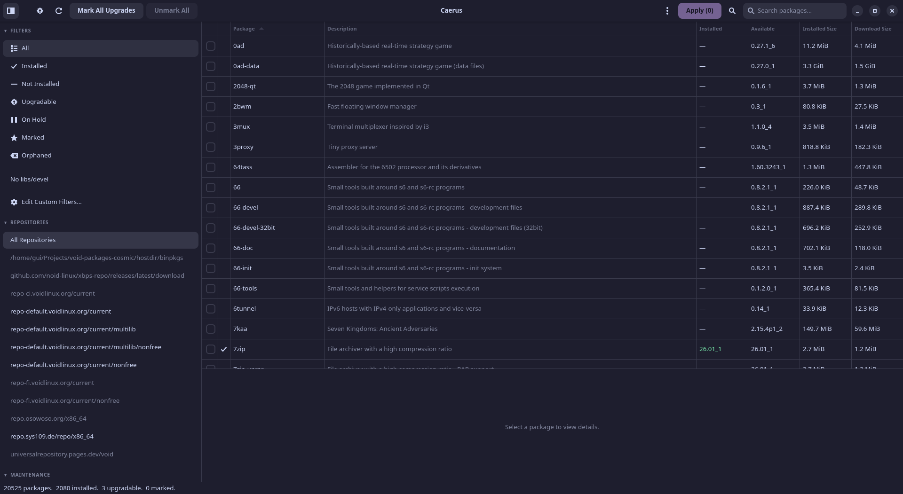
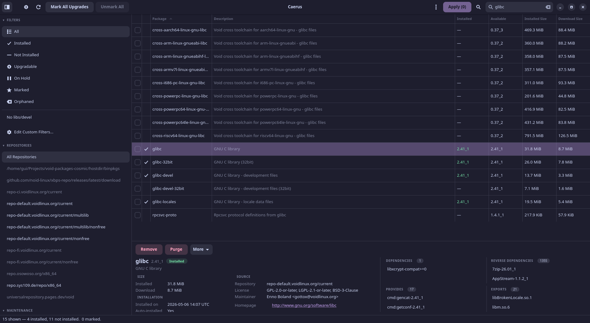
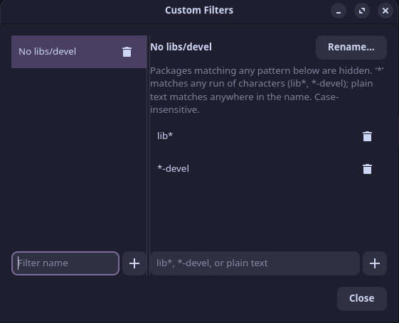
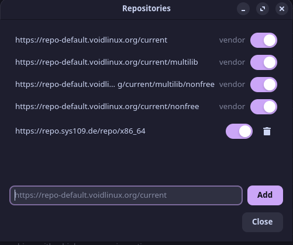

# Caerus

A GTK4 front end for [Void Linux's](https://voidlinux.org/) XBPS.

> **Note:** built with the help of AI (Claude) — see [DISCLAIMER.md](DISCLAIMER.md)
> for how it's built, the security assumptions behind it, and known risks.

## Screenshots

<p float="left">
  
  
</p>
<p float="left">
  
  
</p>

## Features

- Package table with search, click-to-sort columns, and per-row
  checkboxes for bulk marking
- Filter by state (All / Installed / Not Installed / Upgradable / On Hold /
  Marked / Orphaned) and by repository
- Custom filters: named sets of exclude patterns (`lib*`, `*-devel`, plain
  text), shown as sidebar rows with a built-in editor
- Detail pane: description, tags, size, maintainer, dependencies, reverse
  dependencies, provides/conflicts/replaces, shared-library requirements,
  and an on-demand file list
- Install / Upgrade / Remove / Purge / Hold / Unhold, with multi-select and
  bulk actions
- From the detail pane's "More" menu: Reinstall, Reconfigure, Download Only,
  Repo-Lock/Release Repo-Lock, and Mark as Manually/Automatically Installed
- Real transaction preview before applying anything — actual sizes,
  ordering, and conflicts from `libxbps` itself, with a "Copy Dry-Run
  Output" button
- Offers to retry with force (ignoring file conflicts or unresolved
  dependencies) if an Apply batch fails
- Warns before a removal that would cascade to dependent packages, showing
  the full chain down to indirectly-affected ones
- Transaction history log of every applied batch and maintenance action
- Full system upgrade, orphaned-package removal, cache cleanup, database
  verification, force-reconfiguring every installed package, and purging
  old kernel files/modules (`vkpurge`), from the app menu
- Find which package owns a file (`xbps-query -o`), and switch between
  packages providing the same files (`xbps-alternatives`)
- Add, remove, and enable/disable repositories, with an optional custom
  display name each
- Keyboard shortcuts (Ctrl+F search, F5 reload, Delete to mark for removal,
  Ctrl+A select all, Escape to clear search, Ctrl+Q to quit)
- App menu with View toggles and settings (sync-at-launch, default search
  mode); sidebar sections collapse individually, F9 hides the sidebar
- Optional libadwaita look (`--features adwaita` at build time — see
  [Build and install](#build-and-install))

<details>
<summary>Every Caerus action and its underlying xbps command</summary>

| Caerus Action | Where in UI | Underlying xbps command |
|---|---|---|
| Sync repositories | Header sync button / at launch | `xbps-install -S` |
| Full System Upgrade | App menu | `xbps-install -y -Su` |
| Install / Upgrade (Apply) | Checkbox, context menu, detail pane, Apply | `xbps-install -y -- pkg...` |
| Remove | Checkbox, context menu, detail pane, Apply | `xbps-remove -y -- pkg...` |
| Purge | Checkbox, context menu, detail pane, Apply | `xbps-remove -y -R -- pkg...` |
| Install (force retry) | "Retry With Force" after a failed Apply | `xbps-install -y -I -- pkg...` |
| Remove (force retry) | "Retry With Force" after a failed Apply | `xbps-remove -y -F -- pkg...` |
| Purge (force retry) | "Retry With Force" after a failed Apply | `xbps-remove -y -R -F -- pkg...` |
| Reinstall | Detail pane → More | `xbps-install -f -y -- pkg...` |
| Reconfigure | Detail pane → More | `xbps-reconfigure -f -- pkg...` |
| Download Only | Detail pane → More | `xbps-install -D -y -- pkg...` |
| Hold | Detail pane → More | `xbps-pkgdb -m hold -- pkg...` |
| Release Hold | Detail pane → More | `xbps-pkgdb -m unhold -- pkg...` |
| Repo-Lock | Detail pane → More | `xbps-pkgdb -m repolock -- pkg...` |
| Release Repo-Lock | Detail pane → More | `xbps-pkgdb -m repounlock -- pkg...` |
| Mark as Automatically Installed | Detail pane → More | `xbps-pkgdb -m auto -- pkg...` |
| Mark as Manually Installed | Detail pane → More | `xbps-pkgdb -m manual -- pkg...` |
| Remove Orphaned Packages | App menu | `xbps-remove -y -o` |
| Clean Package Cache | App menu | `xbps-remove -O` |
| Verify Package Database | App menu | `xbps-pkgdb -a --checks files,dependencies,alternatives,pkgdb` |
| Reconfigure All Packages | App menu | `xbps-reconfigure -fa` |
| List removable kernels | Purge Old Kernels window | `vkpurge list` (not xbps — runs unprivileged, straight from the GUI) |
| Purge Old Kernels | Purge Old Kernels window | `vkpurge rm <version...>` (not xbps — the one part of this row that's privileged) |
| Switch Alternative | Alternatives dialog | `xbps-alternatives -g <group> -s <pkg>` |
| Add Repository | Repositories dialog | writes `/etc/xbps.d/90-caerus.conf` (no xbps CLI), then queues `xbps-install -S` |
| Remove Repository | Repositories dialog | edits the same conf file, then `xbps-install -S` |
| Transaction preview / dry-run | Apply confirmation dialog | `xbps_transaction_prepare()` via libxbps directly — equivalent to `xbps-install -n` |
| Find Owning Package | App menu → Find Owning Package | `xbps-query -o <path>` (the only literal `xbps-query` subprocess call in the app) |
| Package details, deps, reverse-deps, files, provides/conflicts/replaces, shlib info | Detail pane | via libxbps directly (`xbps_pkgdb_get_pkg`/`xbps_rpool_get_pkg` + dictionary reads) — equivalent to `xbps-query -S/-x/-X/-f` |

</details>

## Installing

### Quick install

```sh
curl -fsSL https://raw.githubusercontent.com/mendescotta/Caerus/main/get-caerus.sh | sh
```

Clones the repo, offers to install missing build dependencies via
`xbps-install`, builds with `cargo build --release`, then asks whether to
run it, register it for your user, or install it system-wide. Read
[get-caerus.sh](get-caerus.sh) before piping it to `sh`, same as any
installer script — it only builds from source, no prebuilt binary
involved.

### Dependencies

Build-time:

- A Rust toolchain (`rustc`/`cargo`) — 2021 edition or newer
- `gtk4-devel`, `libxbps-devel`, `glib-devel`
- `clang` and `pkg-config` (used by `xbps-sys`'s build script to locate
  `libxbps` and generate its FFI bindings via `bindgen`)

Runtime:

- `gtk4`, `libxbps`, `glib`
- `polkit`, with a polkit authentication agent running (any desktop
  environment's default one is fine — GNOME, KDE, xfce4-polkit, lxqt-policykit,
  etc.)

On Void Linux:

```sh
xbps-install -S cargo gtk4-devel libxbps-devel glib-devel polkit clang pkg-config
```

Only Void's **glibc** variant is built, tested, and covered by CI. The
**musl** variant is untested — it may work, but nobody's checked; see
[DISCLAIMER.md](DISCLAIMER.md) for details.

### Build and install

```sh
cargo build --release
sudo ./install.sh
```

Add `--features caerus/adwaita` to the build command (needs
`libadwaita-devel`) for a handful of libadwaita widgets in place of plain
GTK4 — a build-time choice, not a runtime one.

`install.sh` puts `caerus` in `/usr/bin`, `caerus-helper` in
`/usr/libexec`, and registers the `.desktop` launcher, polkit policy,
metainfo, and icons (`PREFIX=/usr/local` or similar to install
elsewhere). Launch from your application menu, or just run `caerus`.

### Running without installing

```sh
cargo build --release
./target/release/caerus
```

Works straight out of the build tree — `caerus-helper` and the app icon
are both found relative to the binary, no install needed. The desktop
shell (Alt-Tab, Overview, top bar) won't know its real name/icon without
an installed `.desktop` entry, though; fix that with no root at all:

```sh
./install.sh --user
```

Registers under `~/.local/share`, pointing at whichever build (`release`
preferred, else `debug`) exists in this checkout. Re-run after switching
between debug and release builds.

### Uninstalling

```sh
sudo ./install.sh --uninstall          # system-wide install
./install.sh --user --uninstall        # --user registration
```

(add `PREFIX=...` before the first if you installed with a custom one).

## License

GNU General Public License v3.0 or later — see [LICENSE](LICENSE).
