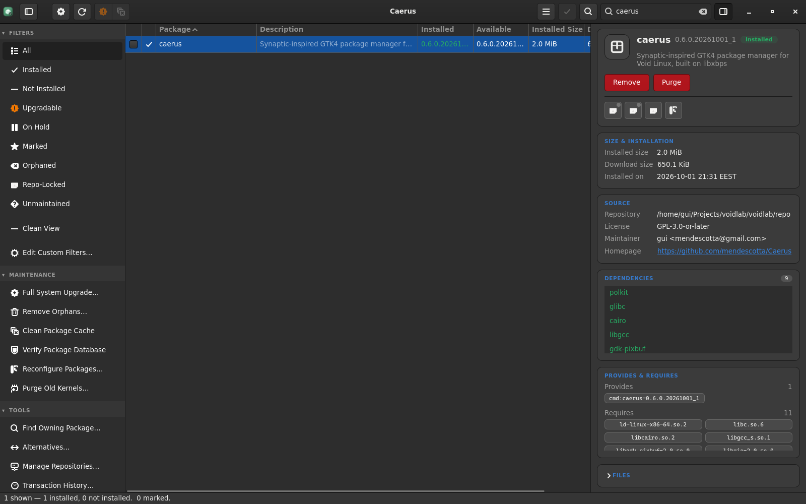

# Caerus

A GTK4 front end for [Void Linux's](https://voidlinux.org/) XBPS.

## Features

- Search, sort and bulk-mark packages
- Filter by state, repository or custom exclude patterns
- Install, upgrade, remove, purge, hold and repo-lock
- Full system upgrade, orphan removal, cache cleanup, kernel purge
- Repository and alternatives management
- Transaction preview and history

## License

GPL-3.0-or-later — see [LICENSE](LICENSE).
